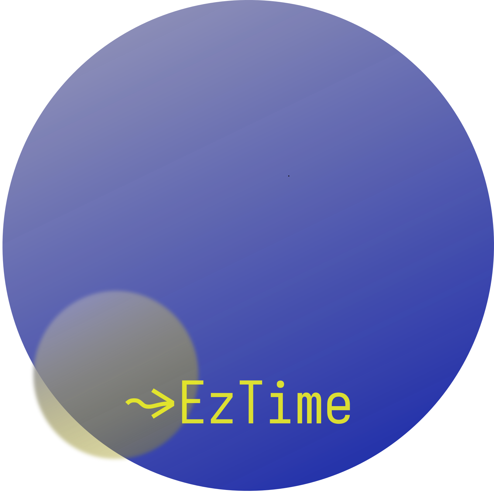

# d4s

_d4s_ is a collection of OSS libraries for writing simple, powerful, and type-safe data transformations in Scala. _d4s'_ core principles are:

1. Libraries should be lightweight, & zero-dependency
2. Impossible states should be unrepresentable
3. Functions should be referentially transparent

The above:
- Eliminates an entire class of bugs
- De-bloats your project dependencies (drop in _d4s_ libs like header files)
- Creates elegant programs via functional composition 

### _d4s_ Modules

  
   
  etl4s

  
   
  eztime

