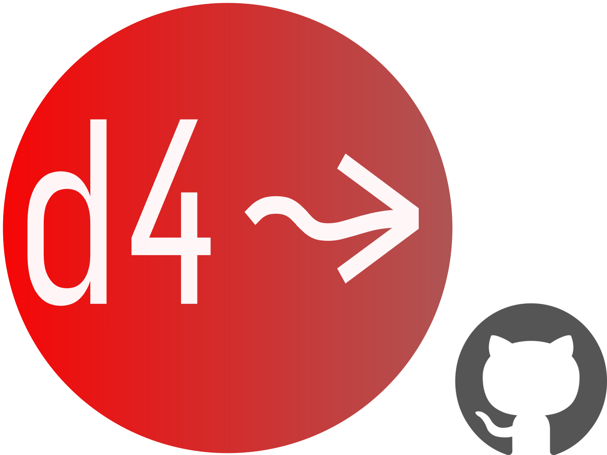

  

# d4s

**_d4s_** is a collection of zero-dependency, single file Scala libraries you can drop into your project like header files. Each library is a simple, powerful building block for 
writing beautiful, type-safe dataflows.
### **_d4s_** Modules

  
  
<strong>etl4s</strong>: whiteboard etl

  
  
<strong>eztime</strong>: time, simplified

  
  
<strong>testd</strong>: pretty, spark, tests

  
  
<strong>pin</strong>: lineage, reinvented

### Inspiration
- [Li Haoyi](https://github.com/com-lihaoyi)
- Jon Pretty's [soundness](https://github.com/propensive/soundness) logos
