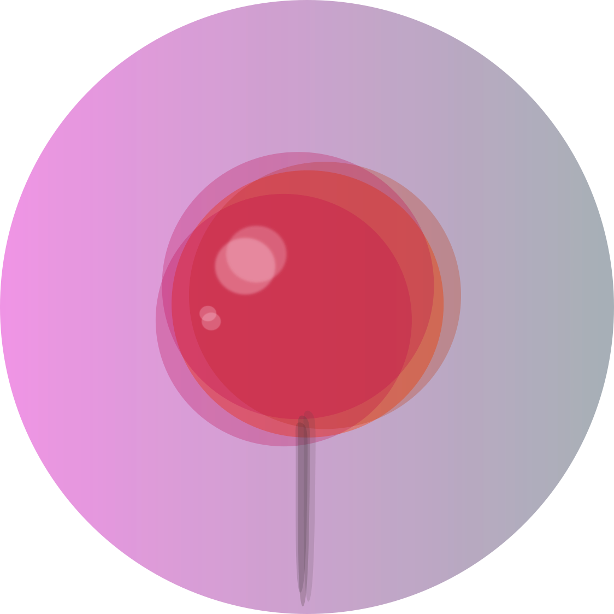

# d4s

**_d4s_** is a collection of zero-dependency, single file Scala libraries. Each library is a simple building block for 
writing beautiful, type-safe dataflows.
### **_d4s_** Modules

  
  
<strong>etl4s</strong>: whiteboard etl

  
  
<strong>eztime</strong>: time, simplified

  
  
<strong>testd</strong>: pretty, spark, tests

  
  
<strong>pin</strong>: state, reinvented

